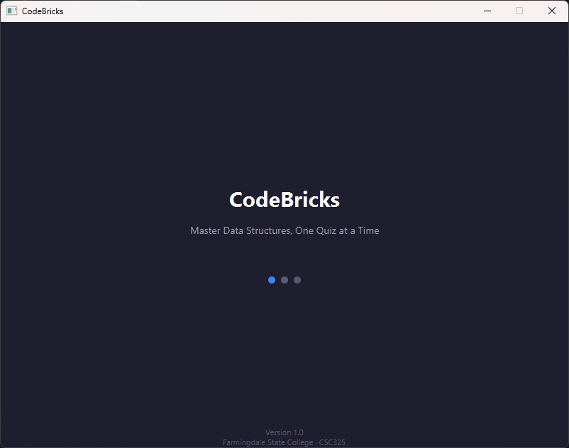
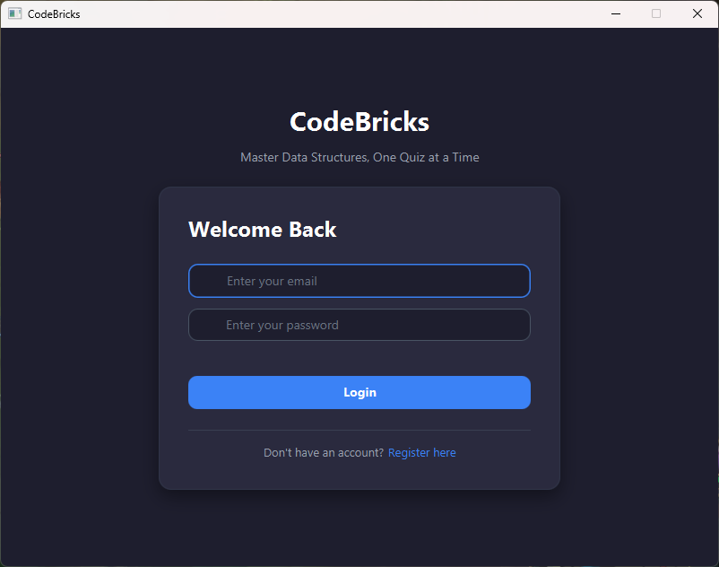
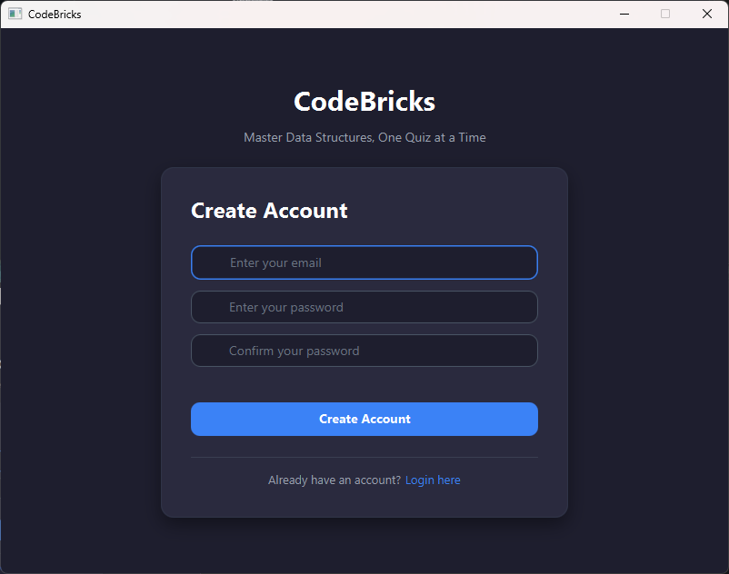
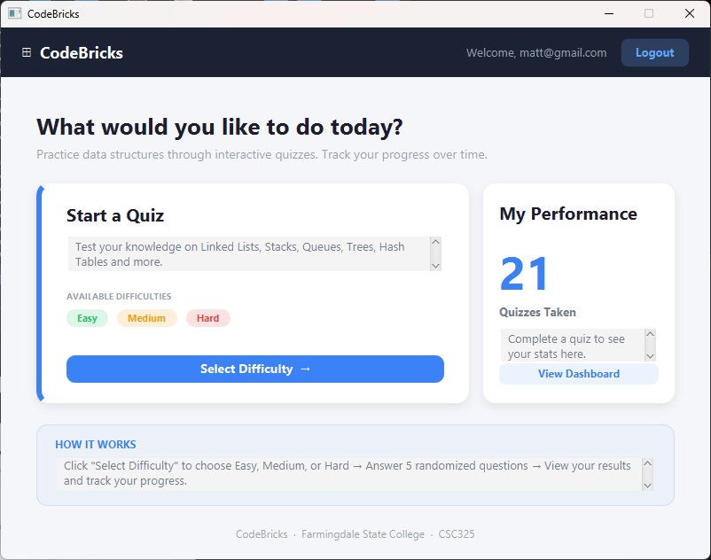
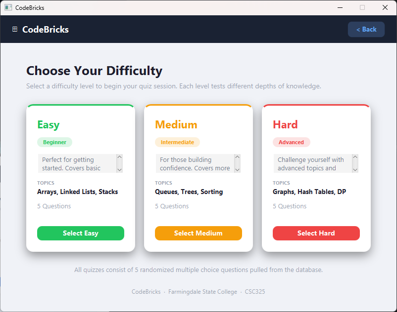
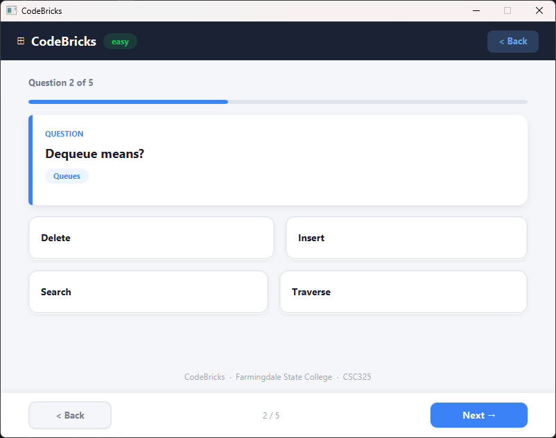
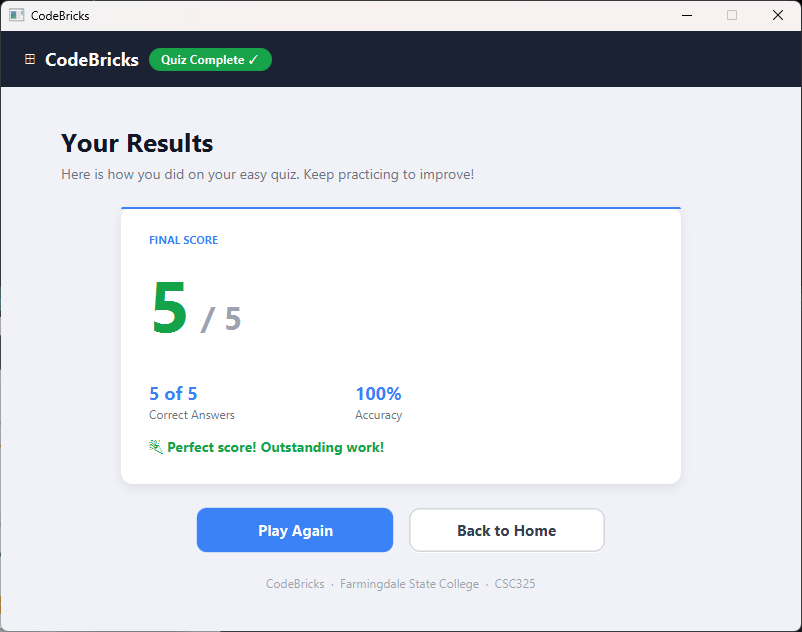
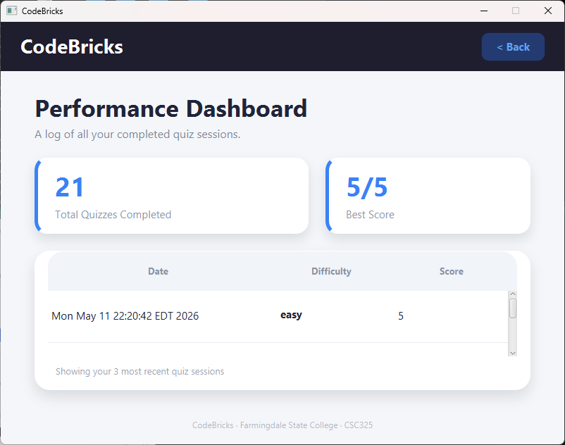

# CodeBricks

> A desktop quiz application for practicing Data Structures and Algorithms.

**Live Site:** https://resjustin1f.github.io/CodeBricks/  
**GitHub Repo:** https://github.com/ResJustin1F/CodeBricks  
**Course:** CSC325 Software Engineering - Farmingdale State College, Spring 2026

---

## Project Summary

CodeBricks is a desktop quiz application that helps computer science students practice Data Structures and Algorithms through randomized multiple-choice quizzes. Users register and log in securely, select a difficulty level, answer 5 randomized questions per session, and view their score and quiz history on a performance dashboard - all persisted to a cloud MongoDB Atlas database.

---

## Features

- Secure registration and login with BCrypt password hashing
- Difficulty selection - Easy, Medium, or Hard
- Randomized 5-question sessions from a 299-question bank
- Real-time progress bar and question navigation
- Score and accuracy displayed on a results screen
- Performance dashboard showing total quizzes and best score
- Session management across all screens until logout

---

## Tech Stack

- JavaFX
- Java
- Maven
- MongoDB Atlas
- BCrypt
- JSON

---

## Architecture

CodeBricks follows an MVC pattern - FXML views paired with Java controllers, backed by a service layer that handles all logic and MongoDB connectivity. Questions are loaded at runtime from `questions.json` and user session state is held in a static `SessionManager` singleton.

**Services**
- `AuthService` - registration and login with BCrypt
- `QuizService` - loads and shuffles questions from questions.json
- `QuizResultService` - saves quiz results to MongoDB
- `PerformanceService` - queries quiz history and best score
- `SessionManager` - holds logged-in user session across screens
- `DatabaseManager` - manages MongoDB client lifecycle


---

## Screenshots

**Splash Screen**  


**Login Screen**  


**Registration Screen**  


**Home Dashboard**  


**Difficulty Selection**  


**Quiz Question**  


**Results Screen**  


**Performance Dashboard**  


**Figma Lo-Fi Prototypes:** https://www.figma.com/design/V52i1hBeMC912bMGD7lmBN/Potential-Code-Brick-Figma

---

## How to Run

**Prerequisites**
- Java
- Maven
- IntelliJ IDEA

```bash
git clone https://github.com/ResJustin1F/CodeBricks.git
cd CodeBricks/TrainingApp
mvn javafx:run
```

---

## MongoDB Setup

Create a `db.properties` file in `TrainingApp/` (same level as `pom.xml`). This file is gitignored and must be created locally.

```properties
db.uri=mongodb+srv://<username>:<password>@<cluster>.mongodb.net/?retryWrites=true&w=majority
db.name=CodeBricks
```

The application expects two collections: `Users` and `QuizResults`.

> Never commit `db.properties` to version control.

---

## SCRUM / Project Management

Developed across 3 sprints using Agile/Scrum with a GitHub Kanban board, weekly standups, and sprint-based tickets.

**Sprint 1 - LoFi Prototypes and Project Proposal**
- Defined requirements (IEEE SRS), created LoFi wireframes, set up repo and branch strategy

**Sprint 2 - Frontend with No Logic**
- Built all 8 FXML screens, global stylesheet, and navigation pattern

**Sprint 3 - Backend Integration and Version 1.0 Release**
- Implemented AuthService, QuizResultService, PerformanceService, connected all screens to live data, and released Version 1.0 to main

**Kanban Board:** https://github.com/users/ResJustin1F/projects/1

---

## Software Engineering Techniques

- MVC architecture - Model-view-controller and service layer cleanly separated
- Singleton pattern - `DatabaseManager` and `SessionManager` use static state
- Scrum / Agile - Kanban board, weekly sprints, standups, and PR reviews
- Branch naming convention - `name/feature/screen-name`
- Dev-first PR strategy - all branches merge into dev before main
- Branch protection - dev requires one approving review before merge
- Manual testing via `mvn javafx:run`, IntelliJ debugger, and console print statements

---

## Team Roles

| Name | Role | Contributions                                                                                               |
|---|---|-------------------------------------------------------------------------------------------------------------|
| Justin Restrepo | Lead Developer and Scrum Master | Project architecture, all 8 FXML screens, AuthService, SessionManager, question bank, GitHub management|
| Jamaluddin Mohammadi | Backend Developer | Home Dashboard, MongoDB integration, Github Pages, Figma                                                    |
| Matthew Fuller | Backend Developer | Difficulty selection, QuizResultService, Results screen, Quiz Results Collections, Figma                    |
| Jeremy Kassim | UI Developer | Performance Dashboard, Live data integration, User Interface architecture, Figma                            |
| Edward Sotelo | Frontend Developer | Bug fixes, dashboard live data, Figma.                                                                      |

---

*Farmingdale State College - CSC325 Software Engineering - Spring 2026*
